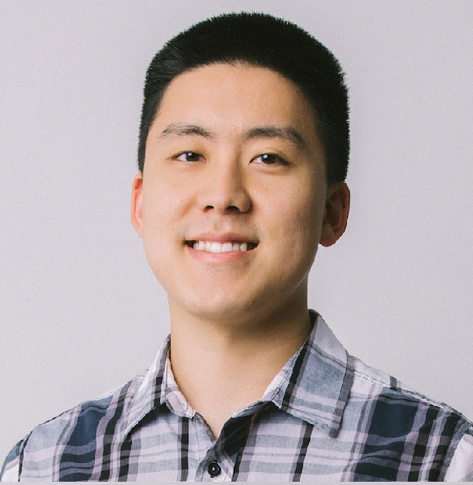

::: {#hero-heading}
<!-- ::: {.headshot}
{width=200px style="border-radius: 50%; margin-bottom: 20px;"}
::: -->

## Hello! 👋

I am a Data Scientist & AI Harness Engineer developing Foundation Models and Agentic ML at UKG. I have 10+ years of experiencing building machine learning systems. In recent years I have developed expertise in LLMs, Agentic Harnesses and adapting to new ways of working with coding agents like Claude Code and Codex. I'm a lifelong learner and enjoy sharing what I've learned with others through writing. I believe writing is thinking.

### Professional Experience

Currently, I'm a Principal Data Scientist at [UKG](https://www.ukg.com/){target="_blank"}, where I focus on applying AI to enhance workforce management solutions. My previous data science roles at [Medidata](https://www.medidata.com/){target="_blank"}, [PIMCO](https://www.pimco.com/){target="_blank"}, [Payoff](https://happymoney.com/){target="_blank"}, and [Allianz](https://allianz.com/){target="_blank"} have given me a diverse background across healthcare, finance, and insurance. Before transitioning to data science, I worked as an actuary.

### What You'll Find Here

- [Technical Blog](https://lawwu.github.io/blog.html) - My thoughts on AI, data science, and technology
- [Today I Learned (TIL)](https://lawwu.github.io/til/) - Quick notes on things I learn daily
- Personal interests including [running](https://lawwu.github.io/blog.html#category=Running){target="_blank"} and [personal finance](https://lawwu.github.io/modest-money-guide/){target="_blank"}

### Let's Connect

I'm open to new consulting opportunities and collaborations. If you'd like to work together, please check out [Doxa Solutions](https://doxasolutions.ai){target="_blank"} or reach out via any of the links above.

You can also [subscribe](https://lawrencewu.substack.com/subscribe) to my newsletter:

<iframe src="https://lawrencewu.substack.com/embed" width="480" height="320" style="border:1px solid #EEE; background:white;" frameborder="0" scrolling="no"></iframe>

:::
