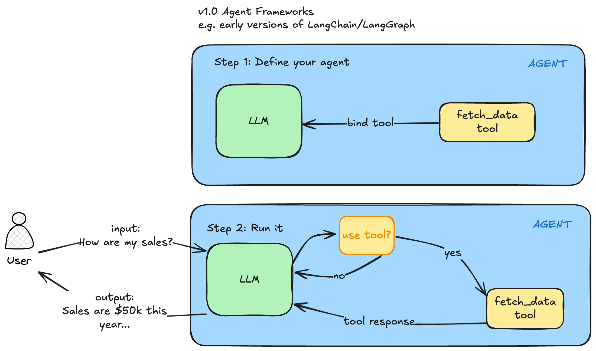
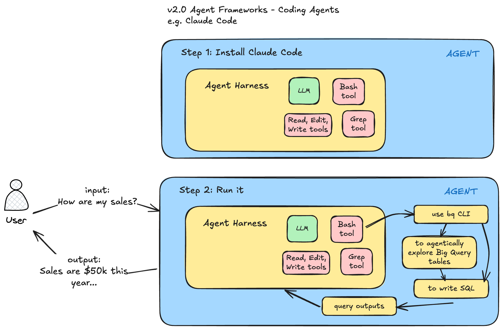

Johannes Gutenberg invented the printing press in Germany around 1440. This new machine that had movable type could print 3,600 pages per day compared to 40 by hand. This is a 90x speedup. It certainly made mass printing books possible because the cost plummeted. But the effect wasn't merely that books got copied faster. The written word became important. Ideas could now spread rapidly. Skills like reading and writing became much more important in this era after the printing press. Society was fundamentally changed.

AI is ushering in a new era like the printing press did. I believe we're entering an era of Agentic Knowledge Work. I define "agentic knowledge work" simply as:

> Using AI Agents to do meaningful amounts of knowledge work.

Just like the printing press had dramatic first and second order effects, AI agents are poised to do the same thing. The first order effect of coding agents is it has become much cheaper to write code. No one knows for certain what second order there will be. However one interesting thing has happened is the amazing generalizability of coding agents like Claude Code. I believe these agents will do more and more knowledge work. You already are seeing it with the development of agent skills and the packaging of skills and other capabilities together to do general software engineering tasks (see [Compound Engineering Plugin](https://github.com/EveryInc/compound-engineering-plugin)) or language model training loops (see Karpathy's [autoresearch](https://github.com/karpathy/autoresearch)).

People used to think software engineering jobs were most at risk because agents could write code so well. But an interesting thing has happened when we created AI agents that could write code. When an AI agent has the ability to write reliable code to do things (along with the ability to use tools), the AI agent can write code in order to accomplish tasks. This is massive. This means you can specify an intent (the what) and leave the implementation details to the agent and the agent will decide what to do (the how). The official [Claude Code docs say something similar](https://code.claude.com/docs/en/how-claude-code-works#delegate-don%E2%80%99t-dictate): "Delegate, don't dictate - Think of delegating to a capable colleague. Give context and direction, then trust Claude to figure out the details."

What an "AI Agent" is has evolved over the last few years. They used to be simple tool-calling agents. Coding agents like Claude Code first emerged in early 2025. However these coding agents like Claude Code and Codex have become more general purpose agents.

## v1.0 Agent Frameworks

We're no longer in the era of creating simple tool-calling agents in an agent framework LangGraph or CrewAI (call it v1.0 of agent frameworks). These were useful and innovative at the time. You could define a tool like `fetch_data_from_bq` and bind it to your LLM. Then when you queried your agent in a situation where the tool would be useful, the tool would be called, the tool response would be set back to your agent and the agent would try to answer your question. The first time I saw this I was amazed. They were called ReAct agents based on this [paper](https://arxiv.org/abs/2210.03629).

You would:

- Step 1: Define your agent with a model like GPT-4 at the time and define a function as a Python fetch (`fetch_data`), bind that tool to the LLM and you had a simple tool calling agent.
- Step 2: Run it.
	- You would pass in a query to your agent "How are my sales?"
	- The LLM would decide, do I have any tools available to answer the query?
	- The fetch_data tool is useful so I will use it
	- The LLM will generate the arguments to call this tool
	- The tool will be called with those arguments
	- The tool response will be sent back to the LLM
	- The LLM will use the tool response to answer the question
	- The final answer will be returned to the user "Sales are $50k this year"



## v2.0 Agent Frameworks

I've had the opportunity to observe this transition first hand. I was a heavy LangChain and LangGraph user since that project started in 2024 and continued a heavy user in 2025 (I [attended their first conference](https://lawwu.github.io/posts/2025-05-30-langchain-interrupt-lwu-recap/) in early 2025). But Claude Code is a different beast. It's a complete different type of agentic harness. The reason it is different are a few:

- the underlying models have improved dramatically and now have reasoning capabilities
- the base tools that Claude Code has access to are very generic. For example with the Bash tool, the agent literally has access to thousands of battle-tested programs (CLIs).
- The biggest change though has been code generation and the ability to create tools on the fly that the agent needs to solve a task.
- You can run these agents in parallel

An analogy I like to give people is imagine you hired a contractor to retile your bathrooms. He needs tools like a wet tile saw to cut the tiles in order to do the job effectively. If he doesn't have this saw, he needs to go buy or rent one. An AI Agent that can write code and reason can create the tools it needs on the fly to accomplish it's task! You no longer need to create tools for an agent (although you still can). You just need to specify what you want and the agent can decide how to get there (either using off the shelf libraries or writing code on the fly to do what it needs). These v2.0 Agent Frameworks are so much more generalizable.



Since I [started using Claude Code regularly in July 2025](https://lawwu.github.io/posts/2025-07-18-starting-to-use-claude-code/), I've noticed a few things in my day-to-day job as a data scientist and data science manager:

- Claude Code can do increasingly complicated tasks
- I no longer am concerned about prompting currently with tricks like "As an expert X" or "Think step step" that were necessary in 2024 but am more focused on specifying my overall goal and intent clearly
- The underlying agent harness changes quite a bit. There are usually [multiple releases every week](https://github.com/anthropics/claude-code/commits/main/CHANGELOG.md). It's now valuable to spend time understanding what functionality the harness is providing. I see this kind of like a craftsman who knows his tools and can use them more effectively.
- "Meta-work" - thinking about my work and how I'm doing it. I'm regularly asking myself, this is how I am used to doing things, what is the agent-first way of doing things?

One small example of this last bullet point was when writing my annual review in October 2025, I usually have a hard time remembering what I've accomplished. But this year I had Claude Code fetch context for me. I prompted it to go our company's private Github and fetch all of my commits, a Jira MCP to see the tickets I've closed and a Confluence MCP to fetch all of the Confluence pages I've authored and summarize the work I've done and how it matches my goals (copy paste goal text here). Claude Code wrote the code to fetch my commits from the Github API using the `gh` CLI and it used our internally hosted Atlassian MCP servers to fetch Jira/Confluence content. This was incredibly valuable in helping me write a rich annual review. But this idea of doing things that were not possible before is something I'm experiencing almost every week now.

## Agentic Machine Learning

I have worked as a data scientist for 10+ years. One of the core functions is to train machine learning models. Kaggle has changed what most people think about data science or machine learning. In a typical Kaggle competition, you are given a clear task, a clear dataset and a clear error metric you are building against. In the real world, none of these 3 things is guaranteed. The business may not give you a clear task. The task may not even be best solved by machine learning. The dataset is usually something you have to create by exploring data, understanding the source data, joining together multiple data sources and engineering features. The error metric is also not always clear either.

I was inspired by Kieran Klaassen's [Compound Engineering Plugin](https://github.com/EveryInc/compound-engineering-plugin) that has 4 Claude Code commands:

- plan: Turn feature ideas into detailed implementation plans
- work: Execute plans with worktrees and task tracking
- review: Multi-agent code review before merging
- compound: Document learnings to make future work easier

I wanted something similar for machine learning workflows in what is agentic machine learning. My first stab at this is the [agentic-ml-plugin](https://github.com/lawwu/agentic-ml-plugin). Currently there are 10 main skills:

- review-target
- plan-experiment
- build-baseline
- check-dataset-quality
- check-data-pipeline
- feature-engineering
- babysit-training
- check-failed-run
- check-eval
- explain-model

I have another skill that runs all 10 of the previous skill in one called `orchestrate-e2e`. You can install it in Claude Code with:

```bash
claude plugin marketplace add lawwu/agentic-ml-plugin
claude plugin install agentic-ml@agentic-ml
```

These are all things that I generally do in an ML project. I find it amazing these can now be specified as skills so that an agent can run them now. You can also create skills that chain other skills together. So given a dataset, an agent like Claude Code can run all of the above steps autonomously.

One issue when working with coding agents is developing trust in agent output. I was inspired by Simon Willison's [showboat](https://github.com/simonw/showboat) repo that creates executable documents to demo an agent's work. I created [mlscribe](https://github.com/lawwu/mlscribe) to create machine-learning specific demo documents. A couple sample skills:

```bash
/orchestrate-e2e on the medium dataset in demo/
```

or

```bash
/orchestrate-e2e on the medium dataset in demo/ but use the mlscribe cli to show me some artifacts. see https://github.com/lawwu/mlscribe
```

But the point of this post isn't necessarily to show all the functionality of these ML specific repos. The point is in a fairly technical job like training machine learning models, I'm seeing glimpses of being able to automate the process. I'm seeing the agent being able to do very valuable work like explore large datasets, create useful machine learning features and write and debug training pipelines. I expect this pattern to spread to other types of knowledge work. For each knowledge work domain, this looks like:

- creating skills
- creating plugins to package up those skills
- chaining together different skills
- creating systems to verify the agent's work

As I models capabilities improve, as agent harnesses improve, as better skills get written for each domain - agents like Claude Code will be able to do longer and longer horizon tasks across most knowledge work tasks.

What will remain for humans to do if things continue to improve? It's impossible to predict the types of jobs that will remain or the new ones that will be created. It's also too difficult to fathom how society, the economy and world will change when "intelligence" is scaled up so massively. As a knowledge worker, it's such an exciting time to be working. Whatever ideas I have, the agent can bring those ideas into existence. Things are changing so fast though. I've never seen my own work habits change so dramatically in my entire career. As a Christian, I'm at peace because I know God is ultimately sovereign and in control. God is the one who created people and he created us to work (Genesis 2:15) so I believe there is a God-imbued value in every person and in every person's work. Therefore, I don't forsee us living in a world where any sort of work or labor will be eliminated.

As we enter into this era of agentic knowledge work, I encourage every knowledge worker to prepare themselves though through learning how to use AI in their specific jobs, especially using these v2.0 Agent Frameworks like Claude Code and Codex.

Other resources:

- I started capturing examples of examples of agentic knowledge work in this [repository](https://github.com/lawwu/awesome-agentic-knowledge-work).
- Simon Willison has a new guide called [agentic engineering patterns](https://simonwillison.net/guides/agentic-engineering-patterns/) for new ways of working in this agentic knowledge era.
- Anthropic published a piece on the [labor market impacts of AI](https://www.anthropic.com/research/labor-market-impacts)
