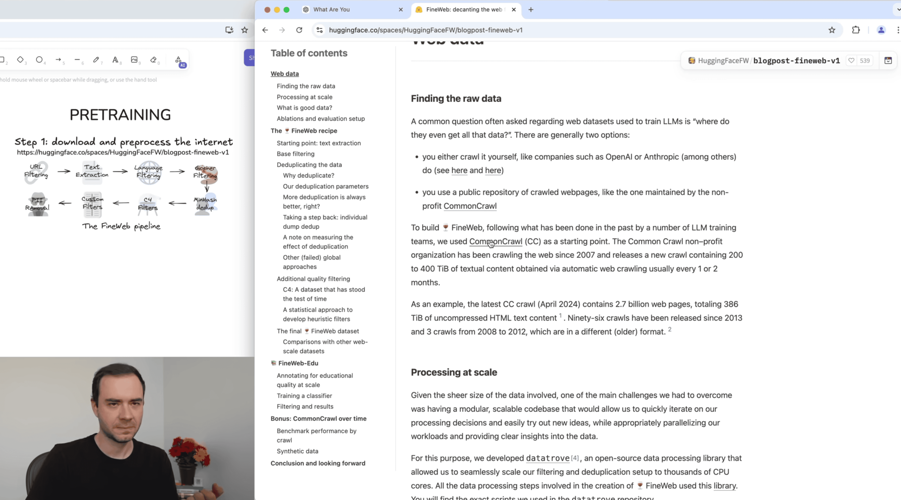
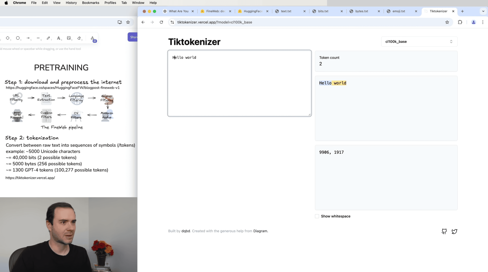
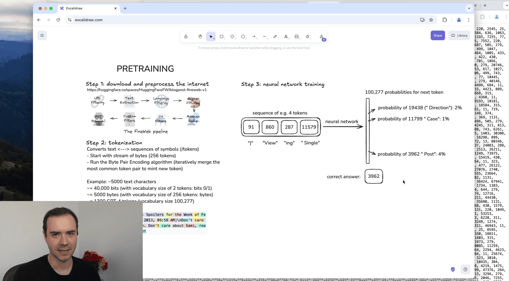
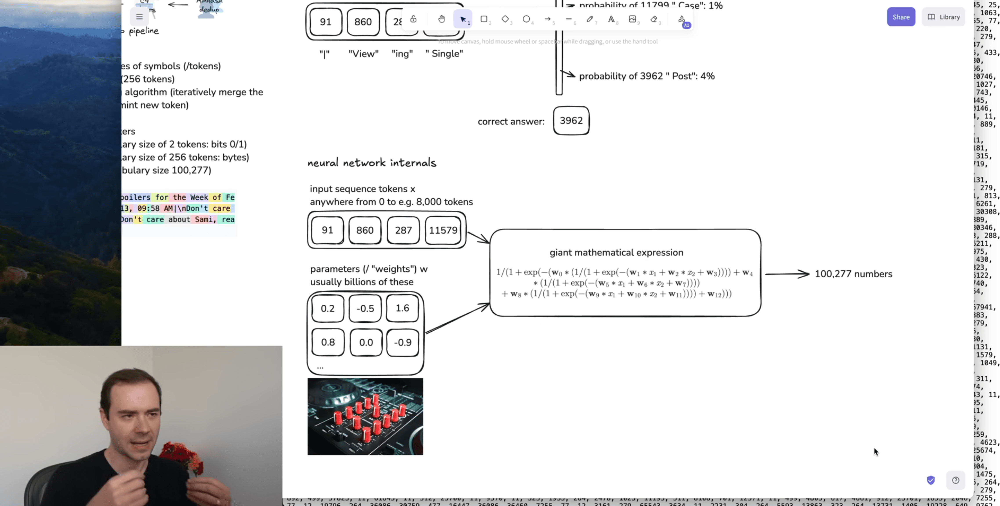
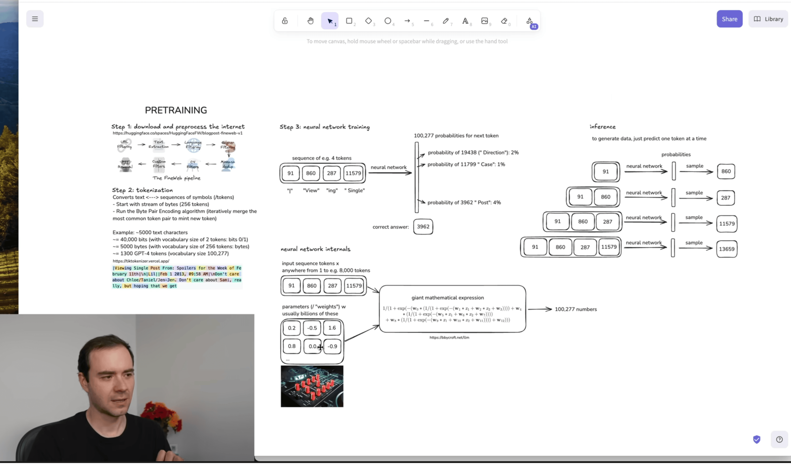
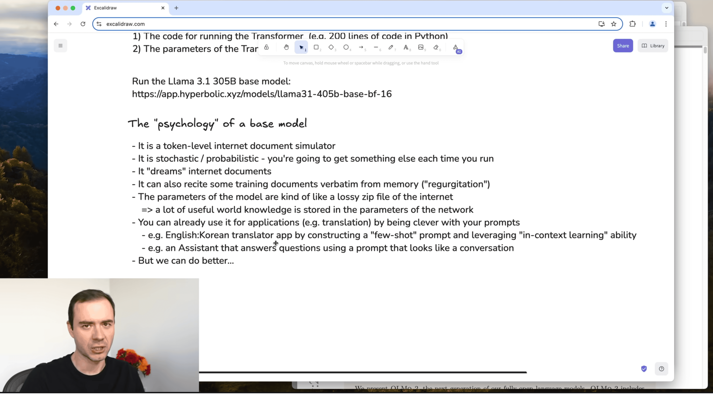
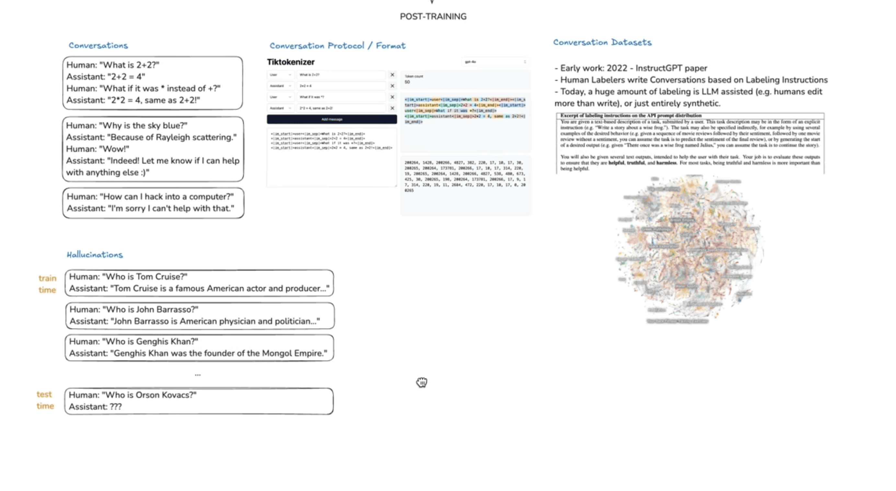
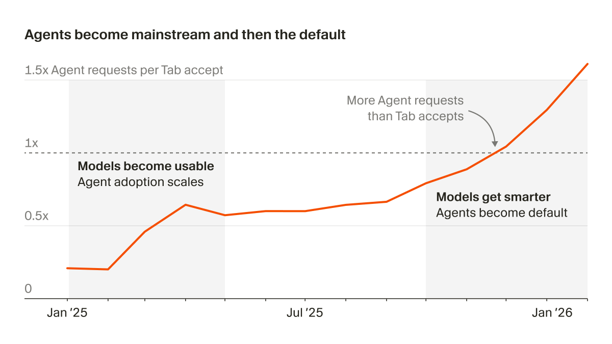
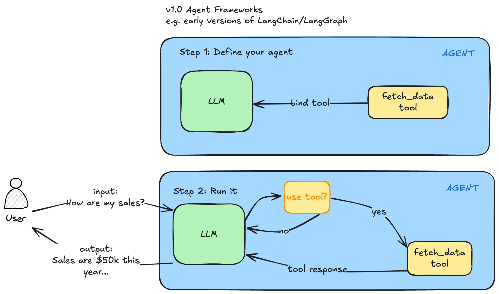
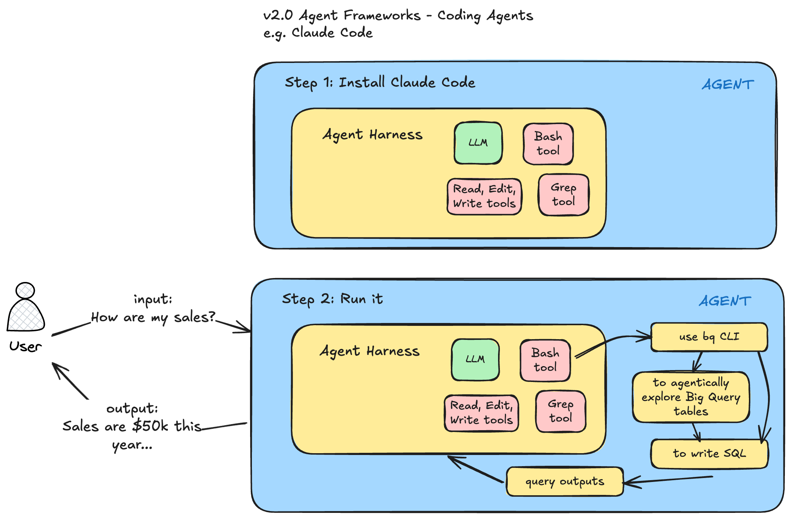

Below is an AI Tutorial I did for some friends. Unfortunately my OBS resolution was set too high so not every frame was captured in the video.

 <!-- markdownlint-disable-line MD034 -->

Below are the notes used.

# Intro

- Why I'm doing this

# Foundational Material

## Language Models

Large Language Models Explained Briefly
<https://www.youtube.com/watch?v=LPZh9BOjkQs&t=1s>

Deep Dive into LLMs like ChatGPT (Karpathy)
<https://www.youtube.com/watch?v=7xTGNNLPyMI&t=8425s>

**Step 1: Pretraining**



**Step 2: Tokenization**



<https://tiktokenizer.vercel.app/>

**Step 3: Neural network I/O**



**Neural network internals**



Show <https://bbycroft.net/llm>

- Artificial Intelligence
  - Machine Learning
    - Supervised Learning - I have labeled data, emails of spam and not spam.
      - Label or not
      - Neural Networks
    - Unsupervised Learning - Clustering - customer data, I want to cluster my customer segments
  - Generative AI
    - Pretraining - thousands of terabytes of data
    - Post-training
  - 2023-2024

**Inference**



**"Psychology" of a base model**



**Post-training**



## Agent Frameworks

<https://lawwu.github.io/posts/2026-03-04-agentic-knowledge-work/>

- No LLM - pre 2023
- LLM, Code Completion - 2023-2024
  - Simple LLM Chains
- Coding IDEs - Cursor, Windsurf - 2024
- Coding Agents - 2025

[Third Era of Software Development](https://x.com/mntruell/status/2026736314272591924)



Thirty-five percent of the PRs we merge internally at Cursor are now created by agents operating autonomously in cloud VMs. We see the developers adopting this new way of working as characterized by three traits:

1. Agents write almost 100% of their code.
2. They spend their time breaking down problems, reviewing artifacts / code, and giving feedback.
3. They spin up multiple agents simultaneously instead of handholding one to completion.

**V1.0 Agent Frameworks**

LLM + a library like LangGraph



**V2.0 Agent Frameworks**

LLM + a CLI like Claude Code

- the underlying models have improved dramatically and now have reasoning capabilities
  - Chain of Thought - My prompt here - think step by step
- the base tools that Claude Code has access to are very generic. For example with the Bash tool, the agent literally has access to thousands of battle-tested programs (CLIs).
- The biggest change though has been code generation and the ability to create tools on the fly that the agent needs to solve a task.
- You can run these agents in parallel



This will continue to improve as

- models improve
  - there will be different types of models too - world models
- harnesses improve

# Claude Code

# Bash Basics

- Terminal
  - ghostty, iTerm2
  - Install zsh
  - What `~/.zshrc` does
  - Common commands
    - `cd`
    - `ls`
    - up/down
    - Ctrl+A, Ctrl+E - hop to beginning or end of line
    - Ctrl+L - clear
    - <https://chatgpt.com/c/69af57dc-ca34-8325-bd74-40028bfeee5b>

## Basics

- Go through <https://code.claude.com/docs/en/how-claude-code-works>
- Then go through <https://github.com/lawwu/claude-code-field-guide>

**Try it out (10 mins)**

On a problem you want to solve.

In `ai-tutorial` VS Code terminal:

```text
i have downloaded cross-references from openbible, can you build a visualization of this data for me?
```

Can show the process:

- don't need to specify the path of the data
  - agentically finds the data
- does some data verification without me asking
  - verifies all 66 books are present
- decides what visualization to build "interactive chord diagram"

```text
❯ i have downloaded cross-references from openbible, can you build a visualization of this data for me?

⏺ Let me first look at the data to understand its structure.

⏺ Read 3 files (ctrl+o to expand)

⏺ 344,800 cross-reference rows. Let me examine the data more and then build a visualization.

⏺ Read 2 files (ctrl+o to expand)

⏺ Good — all 66 books present. Let me build an interactive chord diagram visualization.
```

## Skills and Plugins

- What are skills: <https://code.claude.com/docs/en/skills>
- Open standard now: <https://agentskills.io/home>
- Meta-skills - skills to create skills

Plugins - groups of skills

- <https://github.com/EveryInc/compound-engineering-plugin>
- <https://github.com/anthropics/knowledge-work-plugins>

**Try it out (10 mins)**

Install a plugin and use a skill from a third-party.

# Harness Engineering

Chaining together skills

- <https://openai.com/index/harness-engineering/>
- <https://github.com/lawwu/agentic-ml-plugin>

In `agentic-ml-plugin` VS Code terminal:

```bash
claude --plugin-dir ./plugins/agentic-ml --dangerously-skip-permissions
```

# Agentic Knowledge Work

Some action items:

- meta-work - ask, is there a better way to be doing this? an agent-first way?
- learn the tools
  - it takes time to learn how to use a new tool. Claude Code and Codex both have different functionality. The underlying models are slightly different. 80% of it is the same though.
  - AGENTS.md / CLAUDE.md
  - Have your agent use CLIs. Create CLIs.
  - meta
    - Claude Code can teach you about itself
    - Claude Code can configure itself - "configure a statusline that shows total token cost for the session"
- be constantly learning
- **Don't outpace your understanding**: Review plans, read diffs, and make sure you understand the system well enough to validate what the agent changed
- Still think for yourself

# OpenClaw

Always-on agents
